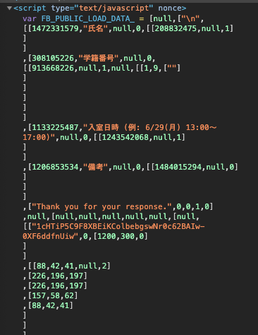

# Googleフォームへの自動入力

## 自動入力の設定

Google フォームのURL
(https://docs.google.com/viewform?)

viewformの後に「usp=pp_url」を加えることで、事前入力があることを知らせてあげる。

次に、フォームの各質問を識別する番号があるので、Chromeの検証画面で質問のdivを探し、2階層目で以下のような番号を探す。




番号を見つけたら`entry.番号=回答内容`の形でパラメータを加える。
以下のような形でつなげればok

```
https://~/viewform?usp=pp_url&entry.1534939278=荒川智則&entry.511939456='+body_temp
```


## 研究室の入退室報告の場合

### 各識別番号

氏名：208832475
学籍番号:913668226
入退室日時：1243542068
備考：1484015294


## 参考

[毎朝5時にGoogle Formに自動回答したい - Qiita](https://qiita.com/kota-yata/items/9d4124ec7a7dd4e3d4f0)